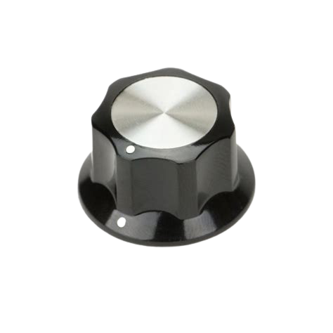
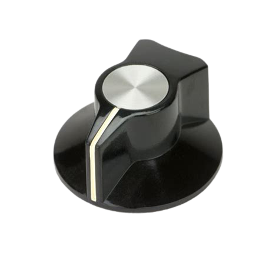

# AudioKnobs

Beautiful old style SVG audio knobs with mouse control (JS embedded within SVG) and dynamic shadows <br>
Modelled from Moog synthesizer knobs.




Check out [Interactive demo](https://megaemce.github.io/AudioKnobs/). Mouse over the knobs to control their angle. Double click on the knob to reset it to the default value.
<br>
<br>


## How to use

Simply copy code of the whole SVG object and past it into your code. You are ready to go 🎉 <br>
Alternatively, you can reference the SVG as an `<object>` or `<iframe>` inside the HTML

```javascript
<object data="knob_free.svg" width="50px" height="50px"></object>
```

## Technology

Created for my other project like [mobbler](mobbler.js.org) and [Sound exercises](https://megaemce.github.io/Sound-exercises/).<br>

I would never create this solution without the help of these people:

-   [desandro](https://github.com/desandro) - mouse controlled [knob logic](https://github.com/desandro/demo/blob/master/2011/dial-knob.html)<br>
-   [aike](https://github.com/aike) - knobs look from great application [webaudiosynth](https://github.com/aike/webaudiosynth)

Thank you :wave:
